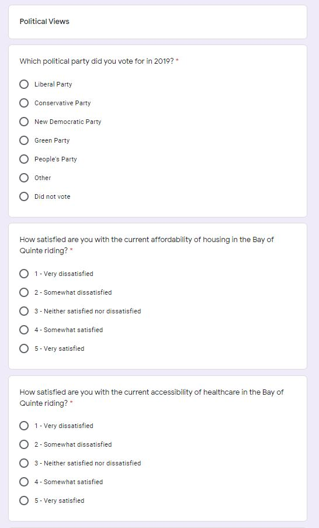
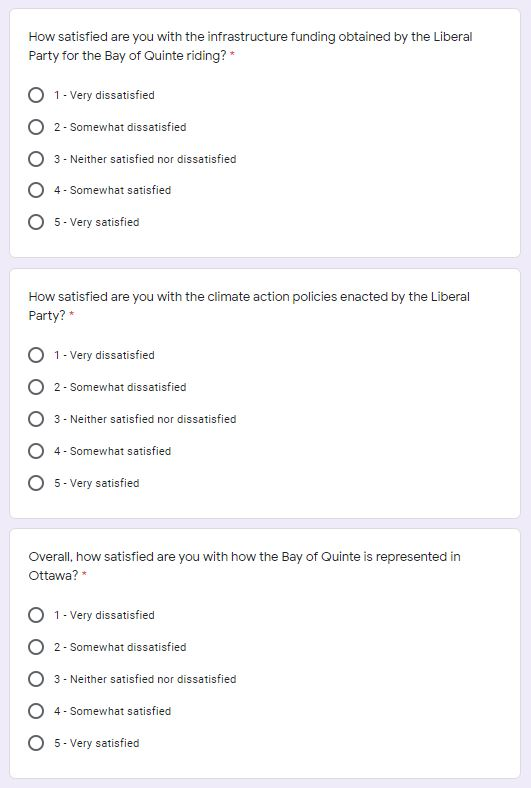

```{r setup, include=FALSE}
knitr::opts_chunk$set(echo = TRUE)
```

# Executive Summary
In the 2019 Canadian federal election, Prime Minister Justin Trudeau won reelection but now faces a minority government in Parliament. This means that although the Liberal Party won the most seats, they did so by a narrow margin and the combination of the seats of the other parties are greater in number than the count of Liberal seats. To solidify their voter base in anticipation of the next election, Petit Poll was tasked by the Liberal Party to develop a monthly polling procedure to analyze voter political sentiment in the Bay of Quinte. 

To conduct such polling, we defined our population of interest as the eligible voters in the Bay of Quinte. Because our constructed frame was the directory of phone numbers of the residents of the Bay of Quinte, we chose to generate our sample using simple random sample without replacement. To distribute the survey, we will randomly draw telephone numbers without replacement from the directory until we have selected 2401 telephone numbers to ensure an error margin of 0.02 with a confidence level of 5%. Then, surveyors will call each number and ask 6 demographic questions and 8 political sentiment questions concerning healthcare accessibility, housing affordability, infrastructure funding, and climate action. These were selected based on research on the platforms of the Bay of Quinte riding candidates in the 2019 election. 

As a placeholder for true survey data, we simulated demographic and political sentiment data based on limited information on physician attachment (how many Ontario residents have a regular healthcare provider), housing, infrastructure assets of Ontario, company climate action policies in Ontario, and so forth. From our simulated data, we determined that we can aggregate ratings to help the Liberal Party determine which issues they should focus on how to best improve the lives of their constituents in the Bay of Quinte. We also found that distinguishing voter satisfaction by party on the important issues mentioned can help the Liberal Party enact policy information to capture the voter base of other parties. Additionally, asking voters about their satisfaction with the leadership of the Liberal Party (primarily the Prime Minister and their representation in Parliament), we are able to provide the Liberal Party with valuable information on the viability of political candidates in future elections. Lastly, we find that with our survey methodology, we have an accurate monthly poll with regards to party affiliation proportions with an error margin of 2% and a confidence level of 5%.

The survey methodology lacks a way to guarantee the full voter population is represented, which can be tackled in future work by devising a new sampling frame based on natural voter stratification. The other weaknesses identified in our surveying methodology include no way to determine result truthfulness (given that the results collected are thoughts and opinions). Hopefully we have sufficiently addressed this using careful survey design. Additionally, in our current methodology, we do not offer a way to reduce non-response rates. In future work, non-response rates could potentially be lessened by revising the survey methodology to offer an incentive for participation.  The simulated data does not stand up to real world expectations but unless otherwise requested by the Liberal Party, is pointless to continue to finetune. Most importantly, the logical next step is to conduct fieldwork as described in this report and collect true survey data.

# Introduction
Two elections ago, the Conservative party won the Bay of Quinte electoral district with a whooping 51% of votes cast (and a 28 point lead on the Liberal Party). Then in 2015, the Liberal Party turned the tables and elected Neil Ellis with a 16 point lead on the Conservative Party. In the most recent election, the Liberal Party reelected Neil Ellis with only 39% of votes (compared to 36% for the Conservatives). To lock down this district in favor of the Liberal Party for future elections, Petit Poll has developed a survey to identify voter sentiment in four main areas: accessibility of healthcare, affordability of housing, infrastructure funding, and climate action. These were the issues championed by most if not all of the candidates in the Bay of Quinte in the 2019 election. 

After simulating survey data, we found that the results could potentially help the Liberal Party in a variety ways.

The rest of this report will discuss our surveying methodology which is further broken down into important definitions, the chosen sampling method, the chosen sample size, survey design, survey distribution, handling non-response, and data simulation. Then, our simulated results and discussion follow. We then conclude with the weaknesses identified in our work and next steps. The appendix contains screenshots of our survey and the code used to simulate and graph the results. Lastly, the paper ends with the references used to produce this report.

# Methodology

## Definitions
The objective of our poll is to understand the current political satisfaction of the residents of the Bay of Quinte riding. Clearly, our population of interest are the eligible voters that reside in the Bay of Quinte. In 2019, Election Canada identified 93,859 eligible voters out of a total population of 109,735 Bay of Quinte residents. Unfortunately, as a non-government entity, Petit Poll does not have access to this complete list of eligible voters. Instead, we constructed a sampling frame from the latest phone directory with the landline and cellular numbers of the residents of the Bay of Quinte. Statistics Canada reported that 99% of households had either a landline or cellular device in 2017 (latest data available) and we do not anticipate any significant changes to that percentage in recent years. Therefore, from the available information at our disposal, this sampling frame is as close to the population of interest as we are likely to get. Lastly, our collected sample will consist of the willing responses to our survey.

## Sampling Method
Because we want to generate a random sample of the individuals in our sampling frame and we don't want to be able to choose the same resident more than once, we have chosen the method of simple random sampling without replacement. Furthermore, selecting our sample using this method also contributes the following statistical properties to our later analysis of collected data (Wu):
$$E(\overline y) = \mu_y $$
and
$$ v(\overline y) = \left(1-\frac{n}{N}\right) \frac{s^2_y}{n}$$

## Minimum Necessary Sample Size
To calculate the minimum necessary sample size, we will specify an error margin of 0.02 with an standard $\alpha$ value of 0.05. In other words, we want to be 95% confident that our results are accurate within a margin of 2%. Our chosen absolute tolerable error is less than what is most commonly used () because Canada has a plurality voting system and every percentage counts. Therefore, we want to be as accurate as we realistically can. On that note, we have not chosen an even smaller absolute tolerable error in the interest of cost and surveying feasibility (we would need a sample size of almost 10,000 to ensure an error margin of 0.01 when $\alpha = 0.05$). Our calculations for the minimum necessary sample size for an error margin of 0.02 for the estimation of a proportion (distribution of current political affiliation) with a confidence level of 5% is as follows:
$$
n = \frac{Z_{\alpha/2}^2(p)(1-p)}{e^2} = \frac{(1.96)^2(0.25)}{(0.02)^2} = 2401
$$
Because we don't know the population proportion, we use 0.25 for the value of $(p)(1-p)$ for the most conservative calculation of necessary minimum sample size. 

## Survey Design and Respondent Privacy
Screenshots of our survey can be found in the appendix.

The survey we designed with the residents of the Bay of Quinte in mind consists of 6 demographic questions and 8 questions on respondents' political views. The demographic questions ask for respondents' citizenship, age, gender, ethnicity, education level and household income. These questions in conjunction with respondent answers to political view questions will help the Liberal Party the demographics of their support base and also the support base of similarly left leaning parties (the New Democratic Party comes to mind). 

The political views questions were constructed based on the platforms of the candidates in the 2019 Federal Election. As the candidates themselves have the best idea of the political issues that their voter base faces, we have chosen the issues they recently championed in 2019 to focus our political questions on. We asked respondents about their satisfaction with housing affordability, accessibility of healthcare, infrastructure funding, and climate action policies. These were ordered in decreasing order depending on how many candidates mentioned the issue in their campaign platform (i.e., housing affordability was mentioned by most of the candidates and climate action was the fourth most commonly mentioned issue). The remaining 3 political questions asked respondents which party they voted for in 2019, how satisfied they are with the work of their elected Member of Parliament, how satisfied they are with the leadership of Prime Minister Trudeau, and their current political affiliation. (The multiple choice answers to these questions are designed based on the Likert satisfaction scale (Survey Monkey)). These targeted questions for the Bay of Quinte riding can help the Liberal Party to best determine which issues the voter base is most concerned about, satisfaction with current leadership, the correlation between these two results, and so forth. Big picture-wise, the information from this regular monthly survey can help the Liberal Party determine how to proceed and appeal to voters in the next federal election.

Lastly, privacy will be protected by omitting any personally identifiable information from survey records. An explanation on our data confidentiality policy will be read to participants before the beginning of the survey (and can be seen at the top of the digital version of our survey). This leaves us with anonymized results for analysis. 

## Survey Distribution and Anticipated Cost
Putting it all together, given our collected directory of phone numbers for the residents of the Bay of Quinte, we will randomly draw telephone numbers without replacement until we have selected 2401 telephone numbers to ensure an error margin of 0.02 with a confidence level of 5%. Surveyors will introduce the objective of our survey and read the confidentiality agreement to participants. Then surveyors will ask the 14 questions, verbally providing the possible answer choices.

Outside of the payment provided to Petit Poll for services rendered, here is the break down that we anticipate this survey field work will cost. Having run through a simulation survey over the phone which only took 3 minutes to complete, let's assume that each survey will take a conservative 5 minutes to complete. Then, to interview 2401 people, this will roughly take around 200 hours. Besides labor costs (\$3000), other costs include buying phone sets for surveyors to use (\$1000), paying for phone service (\$50/month), and pay for a venue to conduct calls (\$2000/month). Depending on the resources available to the Liberal Party (volunteers, phone system and venue setup), this could cost up to \$6000/month (plus a one time purchase of phone sets).

## Handling Non-Response
Although non-response is unavoidable (individuals not picking, not willing to participate, etc.), we can lessen the effect of any possible non-response biases on our collected data by comparing the collected demographic distribution to expected demographic distributions (available from a census or other government survey). For example, let's hypothetically say that education level plays a large role in determining voter political affiliation. However, when looking at our collected data, we find that the distribution of education levels differs from what the last census reported because of the non-response bias. Then, this makes the sampled political affiliation proportions different from the population proportions because our sample is not representative of the population. Therefore, to estimate the true population proportion using our data, we will reweigh the responses so that the sample distribution regarding education level resembles that of the population.

## Data Simulation
As a placeholder in this report, we will simulate data for our survey based on the information collected by the Canadian government on population demographics.

The code used to simulate the results as described can be found in the Appendix. 

```{r, echo=FALSE, message=FALSE}
library(tidyverse)

# for reproducibility 
set.seed(42)
# minimum necessary sample size calculated earlier
n = 2401

# citizenship
options <- c("Yes", "No")
citizenship <- sample(x=options, size=n, replace=TRUE, prob=c(0.98, 0.02))

# age
options <- c("19 and under", "20-34", "35-49", "50-64", "65 and over")
age <- sample(x=options, size=n, replace=TRUE, prob=c(0.20, 0.17, 0.16, 0.24, 0.23))

# gender
options <- c("female", "male")
gender <- sample(x=options, size=n, replace=TRUE, prob=c(0.51, 0.49))

# ethnicity
options <- c("Aboriginal", "Caucasian", "African or Caribbean", "Latin American", "Asian or Pacific Islander")
ethnicity <- sample(x=options, size=n, replace=TRUE, prob=c(0.065, 0.89, 0.01, 0.005, 0.03))

# education
options <- c("No diploma", "High school or equivalent", "College or other non-university equivalent", "University undergraduate", "University graduate")
education <- sample(x=options, size=n, replace=TRUE, prob=c(0.2, 0.31, 0.36, 0.09, 0.04))

# income
options <- c("Under $20,000", "$20,000 - $39,999", "$40,000 - $59,999", "$60,000 - $79,999", "$80,000 - $99,999", "$100,000 and over")
income <- sample(x=options, size=n, replace=TRUE, prob=c(0.34, 0.28, 0.18, 0.1, 0.05, 0.05))

# vote
options <- c("Liberal", "Conservative", "New Democratic", "Green", "People's", "Other", "Did not vote")
vote <- sample(x=options, size=n, replace=TRUE, prob=c(0.26, 0.242, 0.10, 0.04, 0.013, 0.005, 0.34))

# housing
options <- c(1, 2, 3, 4, 5)
housing <- sample(x=options, size=n, replace=TRUE, prob=c(0.01, 0.19, 0.07, 0.04, 0.69))

# healthcare
options <- c(1, 2, 3, 4, 5)
healthcare <- sample(x=options, size=n, replace=TRUE, prob=c(0.03, 0.06, 0.1, 0.54, 0.27))

# infrastructure 
options <- c(1, 2, 3, 4, 5)
infrastructure <- sample(x=options, size=n, replace=TRUE, prob=c(0.02, 0.14, 0.68, 0.14, 0.02))

# climate
options <- c(1, 2, 3, 4, 5)
climate <- sample(x=options, size=n, replace=TRUE, prob=c(0.02, 0.14, 0.62, 0.2, 0.02))

# parliament
options <- c(1, 2, 3, 4, 5)
parliament <- sample(x=options, size = n, replace=TRUE, prob=c(0.02, 0.37, 0.06, 0.16, 0.39))

# trudeau
options <- c(1, 2, 3, 4, 5)
trudeau <- sample(x=options, size = n, replace=TRUE, prob=c(0.17, 0.35, 0.02, 0.31, 0.15))

# party
options <- c("Liberal", "Conservative", "New Democratic", "Green", "People's", "Other")
party <- sample(x=options, size = n, replace=TRUE, prob=c(0.389, 0.365, 0.159, 0.06, 0.019, 0.007))

# tibble of simulated survey results
sim_survey = data.frame(citizenship, age, gender, ethnicity, education, income, vote, housing, healthcare, infrastructure, climate, parliament, trudeau, party)
```

# Results
```{r echo=FALSE, message=FALSE}
issue <- c("Climate", "Healthcare", "Housing", "Infrastructure")
# calculate mean for each issue
average_satisfaction <- c(mean(sim_survey$climate), mean(sim_survey$healthcare), mean(sim_survey$housing),  mean(sim_survey$infrastructure))
# make tibble of average satisfaction rating for each issue
avg_issue_tibble <- data.frame(issue, average_satisfaction)
# plot average satisfaction rating for each issue
ggplot(avg_issue_tibble, aes(issue, average_satisfaction)) + geom_bar(stat="identity") +
  xlab("Political Issue") +
  ylab("Average Satisfaction Rating") +
  ggtitle("Figure 1: The average satisfaction rating for each political issue surveyed.")

# plot housing satisfaction rating distribution
ggplot(sim_survey, aes(housing)) + geom_bar() +
  xlab("Satisfaction Rating") +
  ylab("Count") +
  ggtitle("Figure 2: Satisfaction distribution with regards to housing affordability.")

# find the average satisfaction with affordable housing by political party
avg_housing_by_party = aggregate(x=sim_survey$housing, 
                                 by=list(sim_survey$party), 
                                 FUN=mean)
# rename table of averages by party for readability
avg_housing_by_party = rename(avg_housing_by_party, Party=Group.1, Average=x)
# plot average housing satisfaction rating by party
ggplot(avg_housing_by_party, aes(Party, Average)) + geom_bar(stat="identity") +
  xlab("Party") +
  ylab("Average Satisfaction Rating") +
  ggtitle("Figure 3: Average satisfaction with regards to housing affordability by party.")

# plot healthcare satisfaction rating distribution
ggplot(sim_survey, aes(healthcare)) + geom_bar() +
  xlab("Satisfaction Rating") +
  ylab("Count") +
  ggtitle("Figure 4: Satisfaction distribution with regards to healthcare accessibility.")
  
# find the average satisfaction with healthcare accessibility by political party
avg_healthcare_by_party = aggregate(x=sim_survey$healthcare, 
                                 by=list(sim_survey$party), 
                                 FUN=mean)
# rename table of averages by party for readability
avg_healthcare_by_party = rename(avg_healthcare_by_party, Party=Group.1, Average=x)
# plot average housing satisfaction rating by party
ggplot(avg_healthcare_by_party, aes(Party, Average)) + geom_bar(stat="identity") +
  xlab("Party") +
  ylab("Average Satisfaction Rating") +
  ggtitle("Figure 5: Average healthcare accessibility satisfaction by party.")


# plot trudeau leadership satisfaction rating distribution
ggplot(sim_survey, aes(trudeau)) + geom_bar() +
  xlab("Satisfaction Rating") +
  ylab("Count") +
  ggtitle("Figure 6: Distribution of satisfaction with Trudeau's leadership.")
# plot parliament leadership satisfaction rating distribution
ggplot(sim_survey, aes(parliament)) + geom_bar() +
  xlab("Satisfaction Rating") +
  ylab("Count") +
  ggtitle("Figure 7: Distribution of satisfaction with Parliament representation.")

politician <- c("Trudeau", "Representation in Parliament")
# calculate mean for leadership at each level
average_satisfaction <- c(mean(sim_survey$trudeau), mean(sim_survey$parliament))
# make tibble of average satisfaction rating for leadership at each level
avg_politician_tibble <- data.frame(politician, average_satisfaction)
# plot average satisfaction rating for leadership at each level
ggplot(avg_politician_tibble, aes(politician, average_satisfaction)) + geom_bar(stat="identity") +
  xlab("Leadership") +
  ylab("Average Satisfaction Rating") +
  ggtitle("Figure 8: Average satisfaction rating with Liberal Party leadership.")

# find the average satisfaction with affordable housing by political party
political_affiliation = aggregate(x=sim_survey$party, 
                                 by=list(sim_survey$party), 
                                 FUN=length)
political_affiliation$x = political_affiliation$x / n
# rename table of averages by party for readability
political_affiliation = rename(political_affiliation, Party=Group.1, Proportion=x)
# round proportions to 2 digits
political_affiliation$Proportion = political_affiliation$Proportion %>% round(digits=2)
# output table
political_affiliation
```
Table 1: Political affiliation proportions at time of survey.

# Discussion
We will discuss the results displayed in each of the above figures (and table) in detail as well as describe what the results mean for the Liberal Party. Note that the political sentiment results we have simulated do not necessarily reflect the sentiments of the true population as we had to make educated guesses about the likelihood of each answer based on limited available data.

Figure 1 shows the average rating for each political issue that survey respondents were asked about. If this graph was generated from actual survey responses instead of simulated data, we would conclude that voters in the Bay of Quinte riding are not as satisfied with the government's climate action and infrastructure funding as they are with their access to healthcare and affordable housing. Therefore, the Liberal Party should devote more resources to increasing the satisfaction of voters in regard to climate action and infrastructure funding. If such a policy change is made and voters are able to attribute that change to the Liberal Party, the Liberal Party will be able to capture those voters who are not very satisfied with current climate action or infrastructure policies. 

Figure 2 is a graph of rating counts for housing affordability satisfaction. This graph suggests that a large majority of voters are very satisfied with housing affordability, while the next most common sentiment is that voters are somewhat dissatisfied with housing affordability. These proportions were determined based on the types of dwellings voters in the Bay of Quinte resided in (movable dwelling, apartment building, condominium, semi-detached house, and detached house). We associated the proportion of voters living in detached houses to the very satisfied rating, we associated the proportion of voters living in semi-detached houses to the somewhat satisfied rating, and so on. Although theoretically, owners of detached homes are more likely to be satisfied with housing prices because they can afford a detached house as opposed to an apartment or movable dwelling (RV, boat, etc.), this overlooks too many factors like voter ability to keep up with mortgage payments. True voter sentiment about housing prices in the Bay of Quinte riding needs to be measured by conducting fieldwork and gathering survey responses.

Figure 3 displays the average satisfaction of voters with regards to housing affordability distinguished by political party. If this were real survey data, we could conclude that there is not a large difference between affordable housing experiences across parties. Each party has an average satisfaction rating of about 4, representing the sentiment "somewhat satisfied." If this showed instead that New Democratic Party supporters had low satisfaction with regards to healthcare affordability, this would tell the Liberal Party to focus on housing affordability policies to capture some of the NDP voters.

Figures 4 and 5 can be evaluated along the same vein like Figures 2 and 3. Because this is simulated data, we can't draw any true conclusions about voter sentiment with regards to healthcare accessibility or the average satisfaction rating of healthcare accessibility across different parties. I will mention that the proportion for healthcare accessibility satisfaction ratings were determined by looking at the percentage of Ontario residents (no data available specifically for the Bay of Quinte riding) who had a regular healthcare provider. From those percentages, I set 10% aside from each group for "neither satisfied nor dissatisfied", 30% for "very satisfied" or "very dissatisfied", and 60% for "somewhat satisfied" and "somewhat dissatisfied", resulting in the graphed simulated distribution. 

The results for climate action and infrastructure funding issues are not graphed in the interest of brevity, as the results were simulated using only limited information about infrastructure funding in Ontario and the climate action policies of companies in Ontario. With true data, we would examine their distributions and breakdown by party like above for Figures 2 and 3 and Figures 4 and 5.

In Figures 6, 7, and 8, we graphed the satisfaction of the voters of the Bay of Quinte with regards to the current leadership of the Liberal Party. From Figure 6, we can conclude that Prime Minister Trudeau is a polarizing figure. Because the proportions we chose were based upon Trudeau's national approval rating, the resulting simulated distribution in Figure 6 indicates that more voters are dissatisfied with his leadership than satisfied. The distribution of voter satisfaction in the Bay of Quinte riding with regards to representation in Parliament indicates that a majority of voters are "highly satisfied" with their current representation. The next most common sentiment is "somewhat dissatisfied" which likely are responses from Conservative voters. These two trends are further emphasized in Figure 8, which shows that voters in the Bay of Quinte rate their representation in Parliament on average 0.5 points higher than they would rate Trudeau's leadership. The Liberal Party can use this information to determine if they should make changes to the current leaders of the  party.

Lastly, Table 1 indicates the political affiliation proportions in the Bay of Quinte riding at the time of the survey. As we previously established, due to the sample size we chose, with true survey results we can say that we are 95% confident these proportions are accurate with a margin of 0.02.

Simulated demographic results are not graphed in conjunction with any issues because they face a similar problem to Figures 3 and 5: the results for each question are simulated independently of each other, resulting in similar average ratings across political parties. In true survey results, graphing demographic results against  political sentiment could lead to interesting insights.

# Weaknesses
A noticeable weakness with regards to the surveying method developed in this report is our inability to guarantee that our survey sample is representative of our target population. If we had voter demographic information in addition to their phone numbers, we could make sure to generate a representative sample using stratified random sampling. Alternatively, if we can find natural groupings of the residents in the Bay of Quinte riding, we could potentially randomly sample from natural voter stratification. However, we would have to ensure that sampling from this natural stratification is more representative of the true population than simple random sampling without replacement. 
Another weakness with our survey is that although we have developed a contingency plan in case non-response bias affects our survey results, we haven't really developed any safeguards against non-response. This could be tackled in our next steps with the survey budget in mind.
Lastly, we have no way to determine if the survey results collected are truthful. For example, respondents may be reluctant to share their true political views and thus filter how they respond. However, by not disclosing which party is conducting this survey and by using the established Likert scale of satisfaction, hopefully respondents are not inclined to give untruthful answers when surveyed.

There are several weaknesses that can be identified with regards to the simulated results. Firstly, our theoretical estimates of the proportions for the answers to each survey question are based on limited data that likely don't reflect true voter sentiment (hence the need for this survey). For example, voter sentiment about the affordability of housing likely does not accurately correlate with the type dwelling occupied. Secondly, our results were simulated independently of each other. In the real world, demographic values most likely influence voter sentiment and political affiliation. We didn't capture that in the simulations we generated (resulting in boring graphs for Figures 3 and 5). However, because the simulated data is only meant to be a placeholder, we won't further develop the accuracy of our simulations (unless required to by the Liberal Party).

# Next Steps
As previously discussed, we could develop a stratified random sampling method to better capture the target population. Additionally, we potentially could combat non-response rates by offering an incentive to participate in our survey. Finally, the most obvious next step is to actually follow the survey distribution procedure and actually conduct the survey. Then we could analyze real (and not simulated) survey results and provide the Liberal Party with statistical conclusions and logical political strategies based on those statistical conclusions to capture a larger proportion of the voter base in the Bay of Quinte. 

(We could also further improve the accuracy of our simulations by linking demographics to voter political sentiment if required. However, these would still be only theoretical values that are not as valuable as results from surveying the voters of the Bay of Quinte.)

# Appendix
## Survey
A digital version of the survey can be found at https://forms.gle/zKfZKXxoXvrjan9k9.







## Code
The code used to produce this post can be found at https://github.com/cindyzhang99/sta304_ps1/blob/master/content/post/2015-07-23-r-rmarkdown.Rmd.

```{r eval=FALSE}
library(tidyverse)

# for reproducibility 
set.seed(42)
# minimum necessary sample size calculated earlier
n = 2401

# citizenship
options <- c("Yes", "No")
citizenship <- sample(x=options, size=n, replace=TRUE, prob=c(0.98, 0.02))

# age
options <- c("19 and under", "20-34", "35-49", "50-64", "65 and over")
age <- sample(x=options, size=n, replace=TRUE, prob=c(0.20, 0.17, 0.16, 0.24, 0.23))

# gender
options <- c("female", "male")
gender <- sample(x=options, size=n, replace=TRUE, prob=c(0.51, 0.49))

# ethnicity
options <- c("Aboriginal", "Caucasian", "African or Caribbean", "Latin American", "Asian or Pacific Islander")
ethnicity <- sample(x=options, size=n, replace=TRUE, prob=c(0.065, 0.89, 0.01, 0.005, 0.03))

# education
options <- c("No diploma", "High school or equivalent", "College or other non-university equivalent", "University undergraduate", "University graduate")
education <- sample(x=options, size=n, replace=TRUE, prob=c(0.2, 0.31, 0.36, 0.09, 0.04))

# income
options <- c("Under $20,000", "$20,000 - $39,999", "$40,000 - $59,999", "$60,000 - $79,999", "$80,000 - $99,999", "$100,000 and over")
income <- sample(x=options, size=n, replace=TRUE, prob=c(0.34, 0.28, 0.18, 0.1, 0.05, 0.05))

# vote
options <- c("Liberal", "Conservative", "New Democratic", "Green", "People's", "Other", "Did not vote")
vote <- sample(x=options, size=n, replace=TRUE, prob=c(0.26, 0.242, 0.10, 0.04, 0.013, 0.005, 0.34))

# housing
options <- c(1, 2, 3, 4, 5)
housing <- sample(x=options, size=n, replace=TRUE, prob=c(0.01, 0.19, 0.07, 0.04, 0.69))

# healthcare
options <- c(1, 2, 3, 4, 5)
healthcare <- sample(x=options, size=n, replace=TRUE, prob=c(0.03, 0.06, 0.1, 0.54, 0.27))

# infrastructure 
options <- c(1, 2, 3, 4, 5)
infrastructure <- sample(x=options, size=n, replace=TRUE, prob=c(0.02, 0.14, 0.68, 0.14, 0.02))

# climate
options <- c(1, 2, 3, 4, 5)
climate <- sample(x=options, size=n, replace=TRUE, prob=c(0.02, 0.14, 0.62, 0.2, 0.02))

# parliament
options <- c(1, 2, 3, 4, 5)
parliament <- sample(x=options, size = n, replace=TRUE, prob=c(0.02, 0.37, 0.06, 0.16, 0.39))

# trudeau
options <- c(1, 2, 3, 4, 5)
trudeau <- sample(x=options, size = n, replace=TRUE, prob=c(0.17, 0.35, 0.02, 0.31, 0.15))

# party
options <- c("Liberal", "Conservative", "New Democratic", "Green", "People's", "Other")
party <- sample(x=options, size = n, replace=TRUE, prob=c(0.389, 0.365, 0.159, 0.06, 0.019, 0.007))

# tibble of simulated survey results
sim_survey = data.frame(citizenship, age, gender, ethnicity, education, income, vote, housing, healthcare, infrastructure, climate, parliament, trudeau, party)

issue <- c("Climate", "Healthcare", "Housing", "Infrastructure")
# calculate mean for each issue
average_satisfaction <- c(mean(sim_survey$climate), mean(sim_survey$healthcare), mean(sim_survey$housing),  mean(sim_survey$infrastructure))
# make tibble of average satisfaction rating for each issue
avg_issue_tibble <- data.frame(issue, average_satisfaction)
# plot average satisfaction rating for each issue
ggplot(avg_issue_tibble, aes(issue, average_satisfaction)) + geom_bar(stat="identity") +
  xlab("Political Issue") +
  ylab("Average Satisfaction Rating") +
  ggtitle("Figure 1: The average satisfaction rating for each political issue surveyed.")

# plot housing satisfaction rating distribution
ggplot(sim_survey, aes(housing)) + geom_bar() +
  xlab("Satisfaction Rating") +
  ylab("Count") +
  ggtitle("Figure 2: Satisfaction distribution with regards to housing affordability.")

# find the average satisfaction with affordable housing by political party
avg_housing_by_party = aggregate(x=sim_survey$housing, 
                                 by=list(sim_survey$party), 
                                 FUN=mean)
# rename table of averages by party for readability
avg_housing_by_party = rename(avg_housing_by_party, Party=Group.1, Average=x)
# plot average housing satisfaction rating by party
ggplot(avg_housing_by_party, aes(Party, Average)) + geom_bar(stat="identity") +
  xlab("Party") +
  ylab("Average Satisfaction Rating") +
  ggtitle("Figure 3: Average satisfaction with regards to housing affordability by party.")

# plot healthcare satisfaction rating distribution
ggplot(sim_survey, aes(healthcare)) + geom_bar() +
  xlab("Satisfaction Rating") +
  ylab("Count") +
  ggtitle("Figure 4: Satisfaction distribution with regards to healthcare accessibility.")
  
# find the average satisfaction with healthcare accessibility by political party
avg_healthcare_by_party = aggregate(x=sim_survey$healthcare, 
                                 by=list(sim_survey$party), 
                                 FUN=mean)
# rename table of averages by party for readability
avg_healthcare_by_party = rename(avg_healthcare_by_party, Party=Group.1, Average=x)
# plot average housing satisfaction rating by party
ggplot(avg_healthcare_by_party, aes(Party, Average)) + geom_bar(stat="identity") +
  xlab("Party") +
  ylab("Average Satisfaction Rating") +
  ggtitle("Figure 5: Average healthcare accessibility satisfaction by party.")


# plot trudeau leadership satisfaction rating distribution
ggplot(sim_survey, aes(trudeau)) + geom_bar() +
  xlab("Satisfaction Rating") +
  ylab("Count") +
  ggtitle("Figure 6: Distribution of satisfaction with Trudeau's leadership.")
# plot parliament leadership satisfaction rating distribution
ggplot(sim_survey, aes(parliament)) + geom_bar() +
  xlab("Satisfaction Rating") +
  ylab("Count") +
  ggtitle("Figure 7: Distribution of satisfaction with Parliament representation.")

politician <- c("Trudeau", "Representation in Parliament")
# calculate mean for leadership at each level
average_satisfaction <- c(mean(sim_survey$trudeau), mean(sim_survey$parliament))
# make tibble of average satisfaction rating for leadership at each level
avg_politician_tibble <- data.frame(politician, average_satisfaction)
# plot average satisfaction rating for leadership at each level
ggplot(avg_politician_tibble, aes(politician, average_satisfaction)) + geom_bar(stat="identity") +
  xlab("Leadership") +
  ylab("Average Satisfaction Rating") +
  ggtitle("Figure 8: Average satisfaction rating with Liberal Party leadership.")

# find the average satisfaction with affordable housing by political party
political_affiliation = aggregate(x=sim_survey$party, 
                                 by=list(sim_survey$party), 
                                 FUN=length)
political_affiliation$x = political_affiliation$x / n
# rename table of averages by party for readability
political_affiliation = rename(political_affiliation, Party=Group.1, Proportion=x)
# round proportions to 2 digits
political_affiliation$Proportion = political_affiliation$Proportion %>% round(digits=2)
# output table
political_affiliation
```

# References
Phones: https://www150.statcan.gc.ca/t1/tbl1/en/tv.action?pid=1110022801
Election participation: https://enr.elections.ca/ElectoralDistricts.aspx?lang=e
Wu
https://www.surveymonkey.com/mp/likert-scale/

Census
https://www12.statcan.gc.ca/census-recensement/2016/dp-pd/prof/details/page.cfm?Lang=E&Geo1=FED&Code1=35006&Geo2=PR&Code2=35&SearchText=Bay%20of%20Quinte&SearchType=Begins&SearchPR=01&B1=All&TABID=1&type=0
Healthcare
https://www150.statcan.gc.ca/t1/tbl1/en/tv.action?pid=1310009616&pickMembers%5B0%5D=1.7&pickMembers%5B1%5D=3.1&cubeTimeFrame.startYear=2018&cubeTimeFrame.endYear=2019&referencePeriods=20180101%2C20190101
infrastructure
https://www150.statcan.gc.ca/t1/tbl1/en/tv.action?pid=3610060801&pickMembers%5B0%5D=1.1&pickMembers%5B1%5D=2.1&pickMembers%5B2%5D=3.1&pickMembers%5B3%5D=4.1&pickMembers%5B4%5D=6.1&cubeTimeFrame.startYear=2015&cubeTimeFrame.endYear=2019&referencePeriods=20150101%2C20190101
R code

https://www.elections.ca/content.aspx?section=pol&dir=ann/upd_2019&document=index&lang=e

https://www.quintenews.com/2019/10/16/bay-of-quinte-candidates-discuss-poverty-housing-and-more/